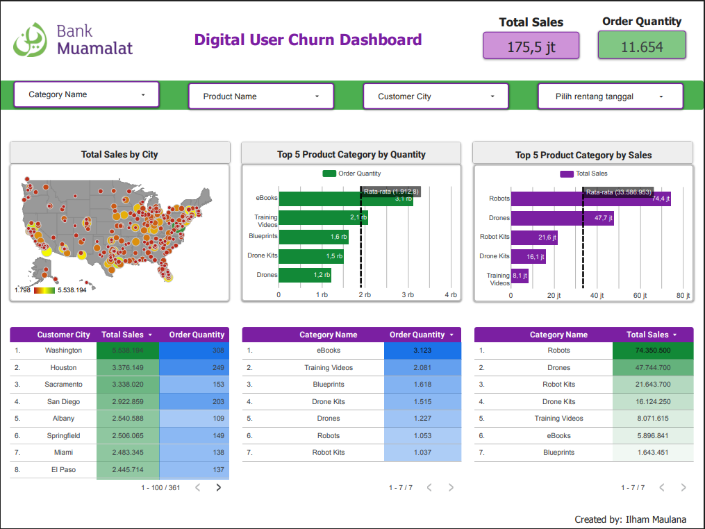

# 📊 Digital User Churn Dashboard – Bank Muamalat

## Overview

This project was completed as the Final Task of the Business Intelligence Analyst Virtual Internship Program by Rakamin Academy.

The dashboard was built using Google BigQuery and Looker Studio to analyze sales transactions and provide business insights through interactive visualizations.

---

## Tools

- Google BigQuery
- Looker Studio
- SQL

---

## Dashboard Preview



---

## Features

- Total Sales KPI
- Order Quantity KPI
- Sales by City
- Top 5 Product Category by Sales
- Top 5 Product Category by Quantity
- Interactive Filters
  - Category
  - Product
  - Customer City
  - Date Range

---

## SQL Query

The SQL query used to create the master table is available in:

```
master_sales.sql
```

---

## Business Insights

- Robots contributed the highest sales.
- eBooks had the highest order quantity.
- Several cities generated significantly higher revenue than others.
- Product promotion can be optimized based on category performance.

---

## Dashboard

Google Looker Studio

[Digital User Churn Dashboard](https://datastudio.google.com/reporting/6e9ec92b-61fd-49fa-b77f-e48ce2fa3098)
---

## Author

Ilham Maulana
